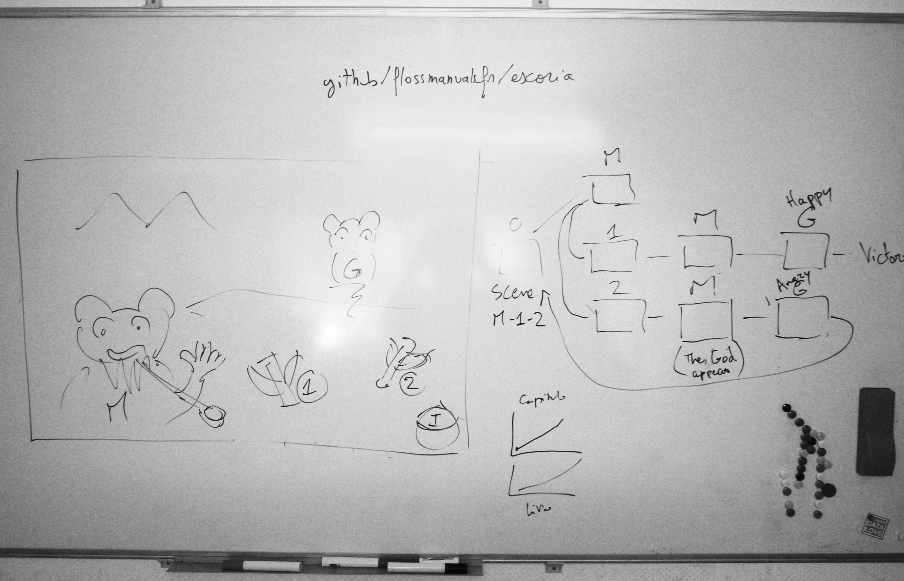

# Chapter II

## Project planning

A game is a complex project, so working on it requires some planning, especially if you are doing everything yourself. It is a good idea to take the time to prepare properly. You will gain time in the long run. Good preparation will also greatly help in creating a good game.

Typical steps we should consider are:

### Scenario

A game relies heavily on a good story, so you need a scenario. In this chapter, we'll look at a scenario for a small game as an example:

*For a long time, the panda tribe lived peacefully in the valley.*  
*But one day the valley was threatened by flooding.*  
*The tribe gathered around the Venerable Panda, who discovered a way to save the valley.*  
*The character needs to collect three pieces of blue bamboo stalk to summon the Great Panda spirit.*  

The scenario can be supplemented with character descriptions and concept art to ensure the universe and characters' personalities are well defined. Another important part is writing dialogue.

### Game mechanics
Here you need to determine what mechanics are typical for your game:

- Will you be collecting items like in Monkey Island?
- Is this a puzzle game with exploration and no inventory, like in the Myst and Riven series?
- Can the player lose and start the game over if he makes a mistake, or will he just get stuck on one scene?
- Is the plot linear or can the player reach multiple endings depending on their actions?
In our game, the panda character will simply collect bamboo to offer to the Great Panda spirit. The story is linear, but if the Great Panda spirit gets angry, the player loses and must start over.

### Storyboard
It is a good idea for artists, as well as game designers, to prepare a storyboard, a rough version of the final work, so that you have a first look at the finished game and can fix it early on. It is always sad to spend hours or days on a scene and then end up deleting it because it does not fit into the overall game. The storyboard phase helps to avoid such a waste of time.

Here's a quick storyboard for the opening scene of our game, which you'll recreate in the next section.

In this opening scene, the main character is not shown, you see the scene from a first person view.

To progress through the story, the player must:
1. Talk to the Venerable Panda (in the photo, "M" stands for "Master"), who asks the player to collect bamboo.
2. Collect bad (1) or good (2) bamboo
3. Talk to the Venerable Panda again, who will summon the spirit of the Great Panda (in the photo, the letter G stands for God)
4. Give the bamboo to the Great Panda spirit, who will be happy with the good bamboo and the player wins, or angry with the bad bamboo and the player loses.

This quick storyboard allowed us to start breaking down our scene into small logical parts (future elements):
1. Venerable Panda (M)
2. Spirit of the Great Panda (G)
3. One good bamboo and one bad bamboo (1 and 2)
4. Inventory (I)
5. Background
We'll break this initial list down into smaller chunks later, but the storyboard gave us a good starting point. For a longer game, you'll want at least one frame of storyboard per scene, and possibly several, detailing what's going on.

### Sounds and music
The audio component of films and games is often underestimated, but sounds are just as important as images in creating the mood and feeling of immersion in the game. So it’s a good idea to plan them from the beginning, start looking for effects or assign this part of the project to a musician.

For our mini-game we will use 3 types of audio resources:
- Background music: it can be more or less long. We'll take a simple Chinese style music, which is quite long, but we'll still make it loop. We can have several pieces of background music that will depend on the scene, but let's keep it simple. It will be in Ogg Vorbis format.
- Event feedback sounds: The most important action is picking up the bamboo stalk and giving it away. It would be nice to have sounds for these events. But other events, like when items appear, could be interesting too. In fact, any change in the scene could have a sound.
- Speech: We might want to add voiceovers for texts and dialogues. To do this, we'll have to add one catalog to the audio catalog for each available language.
